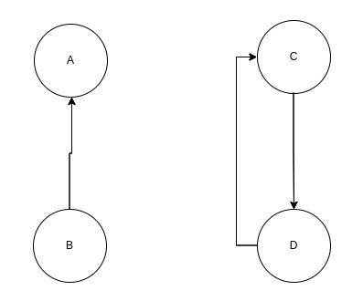
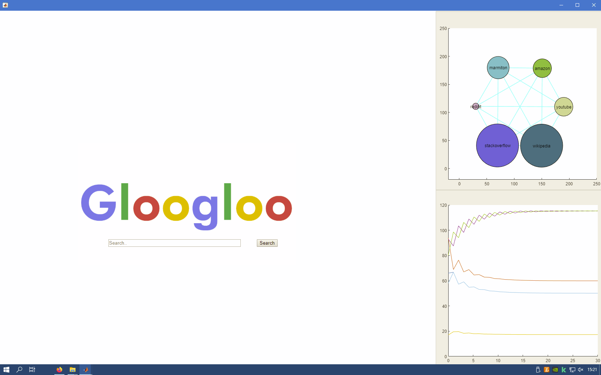
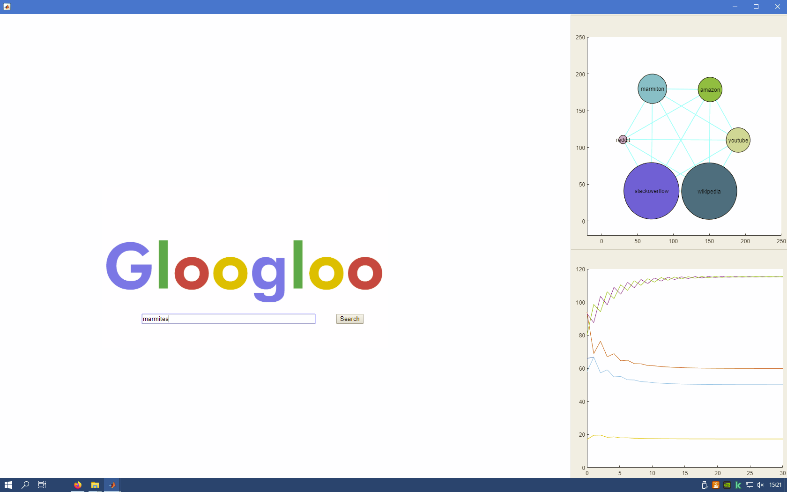
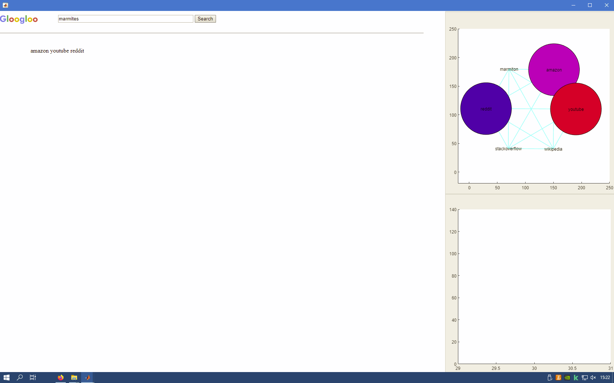
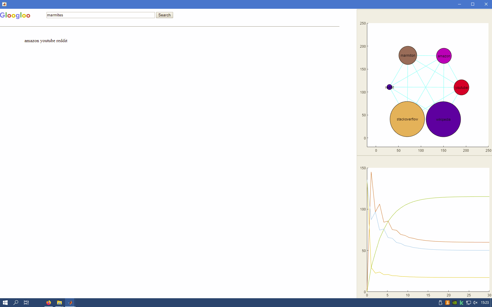

% Rapport du projet Search Engine Machine
% CABRERA Cyril - LOK Tshanon
% Polytech Paris-Saclay - ET5 Info
% 2021-2022

# Table des matières
... A faire ...

# Introduction
Google est une entreprise américaine créée en 1998 par Larry Page et Sergey Brin. Sa fondation repose sur le fameux "Google Search". Ce moteur de recherche est le site le plus visité au monde et le plus utilisé, gérant 3.5 milliards de requêtes par jour. Cela représente 92% de part de marché en 2021.

Cette domination se justifie par la fiabilité de ses réponses. Cela est dû en partie à son algorithme "PageRank". Cette algorithme trie les pages Internet en leur attribuant un rang en fonction de plusieurs critères particuliers. Plus les pages seront hautes de ce système de classification, plus elles seront recommandées aux utilisateurs qui cherchent des termes qui sont en liens avec celles-ci.

Dans ce projet de Data Science, nous avons décidé de recréer les caractéristiques principales de "Google Search", à savoir, l'algorithme "PageRank" de Google ainsi que la fonctionnalité de recherche par mot-clé.

# Méthodes et technologies utilisées
## Matrice Google et "PageRank"
### Matrice Google
L'algorithme "PageRank" a été développé par Google afin de classer un certains nombres de sites web en fonction de leur popularité. 
La popularité d'une page web est définie par le nombre de références qui y sont faites sur tous les autres sites repertoriés.

Considérons par exemple un ensemble de sites web A, B, C, D, E et F qui pointent les uns vers les autres. Si A est référencé sur tous les autres sites, alors il aura une plus grande popularité que les autres. Lors d'une recherche, A sera classé plus haut que B, C, D, E et F dans les résultats.

Le web peut être assimilé à une chaîne de Markov où chaque point représente une page web et chaque transition représente le lien de référence entre ces pages. Donc si A pointe vers B, alors A fait référence à B sur sa page web. À ces transitions sont associées des probabilités qui sont la répartition équilibrée de la probabilité d'aller vers une page référencée.

**Mise en situation :**
Supposons que l'on ait 6 pages web qui pointent les unes vers les autres de la manière suivante.
 

  
Dans notre cas, on retrouve la matrice de transition suivante :
$$
\space \space
\begin{matrix}
A & B & C & D & E & F
\end{matrix}
\\
L =
\begin{pmatrix}
0 & 0 & \frac{1}{2}& 0 & 0 & \frac{1}{2}\\
0 & 0 & 0   & 1 & 0 & 0\\
0 & 0 & 0   & 0 & 1 & 0\\
0 & 1 & 0   & 0 & 0 & 0\\
0 & 0 & 0   & 0 & 0 & \frac{1}{2}\\
0 & 0 & \frac{1}{2} & 0 & 0 & 0\\
\end{pmatrix}
\begin{matrix}
A \\ B \\ C \\ D \\ E \\ F
\end{matrix}
$$

Comme on peut le constater, la somme des éléments de la première colonne vaut 0 car l'élément A ne fait référence à aucun autre état.
Le problème est que l'algorithme ne pourra pas converger. 
Pour pallier ce problème, une notion de téléportation est introduite. On suppose ainsi que tous les noeuds qui ne font référence à aucun état font maintenant référence à tous les états. On obtient ainsi la matrice S suivante :
$$
\space \space
\begin{matrix}
A & B & C & D & E & F
\end{matrix}
\\
S = \begin{pmatrix}
\frac{1}{6} & 0 & \frac{1}{2}& 0 & 0 & \frac{1}{2}\\
\frac{1}{6} & 0 & 0   & 1 & 0 & 0\\
\frac{1}{6} &0 & 0  & 0 & 1 & 0\\
\frac{1}{6} & 1 & 0   & 0 & 0 & 0\\
\frac{1}{6} & 0 & 0   & 0 & 0 & \frac{1}{2}\\
\frac{1}{6} & 0 & \frac{1}{2} & 0 & 0 & 0\\
\end{pmatrix}
\begin{matrix}
A \\ B \\ C \\ D \\ E \\ F
\end{matrix}
$$

Enfin, on remarque qu'il y a deux sous-graphes qui se dressent.
Le graphe [A,C,E,F] et [B,D]. 
On ne peut pas passer du graphe [A,C,E,F] à [B,D] et inversement. Google a donc mis en place une formule :

$$ M = \alpha S + \frac{1 - \alpha}{N}  S  $$

avec alpha qui est un "damping factor" :
$$\alpha = 0.85$$
On obtient ainsi la matrice Google M suivante :
$$
\space \space \begin{matrix}\space \space
A \space \space \space \space \space \space \space \space \space \space \space \space & B\space \space \space \space \space \space \space \space \space \space  & C\space \space \space \space  \space \space \space \space  & D\space \space \space \space \space \space \space \space  & E\space \space \space  & \space \space \space \space \space \space F
\end{matrix}
\\
M = \begin{pmatrix}
0.116667 & -0.025 & 0.4 & -0.025 & -0.025 & 0.4\\
0.116667 & -0.025 & -0.025   & 0.825 & -0.025 & -0.025\\
0.116667 & -0.025 & -0.025  & -0.025 & 0.825 & -0.025\\
0.116667 & 0.825 & -0.025 & -0.025 & -0.025 & -0.025\\
0.116667 & -0.025 & -0.025   & -0.025 & -0.025 & 0.4 \\
0.116667 & -0.025 & 0.4 & -0.025 & -0.025 & -0.025\\
\end{pmatrix}
\begin{matrix}
A \\ B \\ C \\ D \\ E \\ F
\end{matrix}
$$
On se retrouve enfin avec une unique chaine de Markov régulière : pas d'état absorbant et pas de chaine secondaire. 
Tous les états sont donc réguliers, c'est-à-dire que ils peuvent tous être quittés ou rejoints.

### Page Rank
Nous avons maintenant en place la matrice M correspondant à la matrice Google. 
Il est possible, à partir de cette matrice de déterminer le rang de chaque page web.

**Qu'est ce qu'un rang ?**  Le rang correspond à la popularité d'un site web en fonction des autres.

**Explications :**

On considère notre matrice Google M et un vecteur P(t), correspondant à la répartition de la population dans les différents sites web.

À un temps t donné, si on souhaite connaitre la répartition de la population dans les différents sites web après un temps $\Delta t = 1$, il faudrait effectuer cette opération :
$$P(t + \Delta t) = M \cdot P(t)$$
On obtient donc à la période suivante :
$$
P(t + 2 \Delta t) = M^2 \cdot P(t)\\
...\\
$$
Comme la matrice M est indépendante du temps, c'est-à-dire homogène, on en déduit la formule suivante :
$$P(x) = M^x P(0)$$

Donc, après plusieurs pas de temps, on a une probabilité de $(M^{x})_{ij}$, pour passer de l'état j à i en x pas de temps.

On remarque qu'à partir d'un certain temps t, la répartition de la population ne varie plus beaucoup : c'est notre **état d'équilibre**.

Pour déterminer cet état d'équilibre, il faudrait calculer :
$$P(\infty) = M^\infty P(0)$$

Si on attend suffisament longtemps, l'état final i ne dépend plus de l'état initial j. 
Donc $(M^{x})_{ij}$ ne dépend plus de j.
$$
P(\infty) = M^\infty\cdot P(0) \\
          = \vec \pi \\
          \iff M \cdot P(\infty) = P(\infty)
$$

Donc on sait que $\vec\pi$ est vecteur propre de M de valeur propre 1.

Ainsi, pour déterminer le rang des différentes pages web, il faut obligatoirement déterminer le vecteur propre associé à la valeur propre 1, c'est-à-dire trouver $v$ tel que :

$$
\begin{aligned}
M \cdot v &= \lambda v\\
      &= 1 v\\
\end{aligned}
$$

Les vecteurs propres et les valeurs propres peuvent être déterminés par $E(M-\lambda I)$. 
Le noyau d'une matrice A est défini par :
$$Ker(A) = \left\{v \in R^n | \forall u \in A, u \cdot v = 0 \right\}$$
On sait également que $Ker(A) = E(A- \lambda I)$ et que :
$$E(A - \lambda I)  \iff A - \lambda I = 0$$

On calcule donc les vecteurs propres de M :

On trouve dans notre cas, on trouve que le vecteur propre associé à

On constate alors que l'état de nos sites ne bougent pas. Ainsi, c'est pour cela que l'on déduit que le vecteur propre associé à la valeur propre 1 correspond au rang de chacun des sites web.

## Choix de la modélisation
Pour le projet, nous avons mis en place une matrice Google ainsi qu'une interface graphique.
Mise en place du page rank stable
Prise en compte de la popularité, de la probabilité de passer d'une page à une autre
### Les pages web
Afin d'avoir un support pour notre modélisation, nous avons créé des pages web sous forme de fichiers txt.
Les pages web sont actuellement : stackoverflow, reddit, youtube, marmiton, amazon, wikipedia.
Tous ces fichiers txt sont regroupés dans le dossier "pages".

La mise en forme des pages web est la suivante :
Le titre doit être sous la forme :

\\[nom_de_la_page_web_sans_espace] + ".txt".\\

Dans chaque fichier, on trouve un titre pour la page, du texte et des pointeurs vers d'autres fichiers qui sont sous la forme : \\"pointeurvers : [nomPageWeb].txt".\\

Dans notre modélisation, les pages web pointent entre elles de la manière suivante :
[Photo]

Par rapport à notre choix de modélisation, on peut voir que les sites les plus populaires sont :

1. stackoverflow
2. wikipedia
3. marmiton
4. amazon
5. youtube
6. reddit

Il possible d'ajouter d'autres site web en respectant la mise en forme de la modélisation des pages web.

### Code
Pour créer notre moteur de recherche, nous avons créé plusieurs fonctions dont les fonctionnalités seront présentées dans ce document.

#### Function count_Nb_Pages
La fonction count_Nb_Pages prend en paramètre :
- un string correspondant au chemin du dossier contenant nos pages web.
Cette fonction permet de compter le nombre de pages web contenu dans ce dossier. La fonction retourne un nombre que l'on nomme n par la suite.

#### Function init_markov_chain
La fonction init_markov_chain prend en paramètre le nombre de pages web, le chemin des pages web et un paramètre alpha que l'on a fixé à 0.85.

Cette fonction permet d'initialiser la matrice M, correspondant à notre matrice google, ainsi que le vecteur order. Le vecteur order permet de garder en mémoire l'ordre de lecture des différents sites web dans notre matrice M.
Explications:
La matrice M est une matrice de transition. On passe d'un état A à un état B via les références de chaque page. Pour être sûr de l'ordre des états dans la matrice M, on met en place un vecteur order qui permet de garder en mémoire l'ordre.

$$
order =
\begin{pmatrix}
    amazon\\
    marmiton\\
    reddit\\
    stackoverflow\\
    wikipedia\\
    youtube\\
\end{pmatrix}
$$

$$
L =
\begin{pmatrix}
      0 & 0.5000 & 0.5000 &      0 &      0 &      0\\
      0 &      0 &      0 &      0 &      0 & 1.0000\\
      0 &      0 &      0 &      0 &      0 &      0\\
      0 &      0 &      0 &      0 & 1.0000 &      0\\
      0 &      0 &      0 & 1.0000 &      0 &      0\\
      0 & 0.5000 & 0.5000 &      0 &      0 &      0\\
\end{pmatrix}
$$

$$
S =
\begin{pmatrix}
    0.1667 & 0.5000 & 0.5000 &      0 &      0 &      0\\
    0.1667 &      0 &      0 &      0 &      0 & 1.0000\\
    0.1667 &      0 &      0 &      0 &      0 &      0\\
    0.1667 &      0 &      0 &      0 & 1.0000 &      0\\
    0.1667 &      0 &      0 & 1.0000 &      0 &      0\\
    0.1667 & 0.5000 & 0.5000 &      0 &      0 &      0\\
\end{pmatrix}
$$

$$
\begin{matrix}
    amazon \quad&
    marmiton \quad&
    reddit &
    stackoverflow&
    wikipedia&
    youtube\qquad \quad&
\end{matrix}
$$
$$
M =
\begin{pmatrix}
    0.1667 \qquad & 0.4500 \qquad & 0.4500\qquad  & 0.0250\qquad  & 0.0250 \qquad & 0.0250\\
    0.1667 \qquad & 0.0250 \qquad & 0.0250\qquad  & 0.0250\qquad  & 0.0250 \qquad & 0.8750\\
    0.1667 \qquad & 0.0250 \qquad & 0.0250\qquad  & 0.0250\qquad  & 0.0250 \qquad & 0.0250\\
    0.1667 \qquad & 0.0250 \qquad & 0.0250\qquad  & 0.0250\qquad  & 0.8750 \qquad & 0.0250\\
    0.1667 \qquad & 0.0250 \qquad & 0.0250\qquad  & 0.8750\qquad  & 0.0250 \qquad & 0.0250\\
    0.1667 \qquad & 0.4500 \qquad & 0.4500\qquad  & 0.0250\qquad  & 0.0250 \qquad & 0.0250\\
\end{pmatrix}
\begin{matrix}
    amazon\\
    marmiton\\
    reddit\\
    stackoverflow\\
    wikipedia\\
    youtube\\
\end{matrix}
$$

#### Function find_rank
La fonction find_rank prend en paramètre le n, le nombre de pages web, path, le chemin des pages et la matrice M, la matrice Google.

Cette fonction permet de déterminer le rang de chaque page web. Pour cela, il nous suffit de trouver le vecteur propre de la matrice Google M avec une valeur propre associée de 1.

$$
StablePR =
\begin{pmatrix}
    0.2659\\
    0.3178\\
    0.0918\\
    0.6120\\
    0.6120\\
    0.2659\\
\end{pmatrix}
\begin{matrix}
    amazon\\
    marmiton\\
    reddit\\
    stackoverflow\\
    wikipedia\\
    youtube\\
\end{matrix}
$$

**Expliciter le lien avec la partie expliquant la matrice Google.**

#### Function sort_page_search
La fonction sort_page_search permet de chercher un mot parmi les différentes pages web et de retourner la liste des pages web contenant ce mot. La liste des pages web est triée de manière décroissante en fonction du page rank des pages web.

La fonction prend en paramètre :
- hdata : le mot que l'on cherhce
- StablePR : le page rank des pages web
- path : le chemin de chaque page web
- order : un vecteur de string contenant l'ordre de lecture des pages
- n : le nombre de pages web

#### L'interface graphique

Nous souhaitons pouvoir visualiser l'évolution de la population sur les différents sites web au cours du temps.
##### Création du vecteur P

Nous avons donc créé un vecteur P qui correspond à une distribution aléatoire de population qui se trouve déjà sur les differents sites web. Chaque nombre se réfère au vecteur order qui permet de connaitre le nombre dans chaque site précisément.
L'interface graphique a été inspiré par celui du moteur de recherche Google. Cependant, deux graphes ont été ajoutés sur la droite de la fenêtre.

$$
P =
\begin{pmatrix}
    0.2330\\
    0.2585\\
    0.0369\\
    0.2614\\
    0.1818\\
    0.0284\\
\end{pmatrix}
\begin{matrix}
    amazon\\
    marmiton\\
    reddit\\
    stackoverflow\\
    wikipedia\\
    youtube\\
\end{matrix}
$$
La somme de chaque élément du vecteur P vaut 1.

\+ Dire que les couleurs sont cohérentes entre elles

#### Obtention du mot cherché et retour des pages pertinentes
- Retour depuis la page html
- Calcul fait
- Envoie des données vers la page html

- Vecteur P changé
$$
P =
\begin{pmatrix}
    0.3333\\
         0\\
    0.3333\\
         0\\
         0\\
    0.3333\\
\end{pmatrix}
\begin{matrix}
    amazon\\
    marmiton\\
    reddit\\
    stackoverflow\\
    wikipedia\\
    youtube\\
\end{matrix}
$$

- Modélisation dans l'interface graphique modifié pour correspondre à la situation nouvelle.

ATTENTION : PARLER DE LA DOCUmentATION

# Après plusieurs recherches
Combien de temps on met pour revenir à l'état de stabilité ?

On peut le calculer de la manière suivante :
On prend la deuxième plus grande (en valeur absolu) valeur propre.
Calcul

Chez nous : ...

Et si on modifiait $\alpha$ ?

# Répartition du travail
Une grande partie du projet a été effectuée en même temps par les deux membres du projet. En effet, la mise en place de la modélisation, la création de la matrice google M, les différents vecteurs ont été fait lors des 3 séances de TP de DataScience.
Par la suite, l'interface graphique ainsi que les phases de recherche-réponse ont été ajoutés après ces trois séances.
En outre, le projet a été réparti de manière équitable.

On s'est bien réparti le travail **chacal**.

# Résultats

Commentaires sur les photos. On visualise bien la stabilité de la population dans notre modélisation : tout semble cohérent.

# Conclusion
Ce que l'on aurait pu ajouter, améliorer.
Résumé de la partie résultat.
On aurait pu ajouter la pertinence du site web selon le nombre d'apparition du mot cherché.
Si on ajoute des sites web, la modélisation de l'évolution de la population devient de moins en moins lisible. On aurait pu améliorer cela.
On aurait aussi pu améliorer la façon dont les résultats sont affichés : c'est-à-dire le faire comme Google le fait.
On aurait pu, pour aller plus loin, essayer de faire une application : dans le sens où on aurait pu créer un exécuteur pour ne pas aller sur matlab puis cliquer sur RUN.
On pense que ce projet aurait pu être utile pour une entreprise notament dans le cas où cette dernière souhaiterait développer un moteur de recherche interne à l'entreprise tout en essayant de faire des liens entre plusieurs sites, documents. Et ainsi voir les documents/sites les plus utiles.

# Bibliographie
source : https://www.google.com/search/howsearchworks/algorithms/

source : "PageRank algorithm, fully explained", toward data science, Amrani Amine, 20 décembre 2020. Disponible sur : https://towardsdatascience.com/pagerank-algorithm-fully-explained-dc794184b4af

source : Cours de Data Science par Monsieur Desesquelles, délivré septembre 2021.

source : matlab
