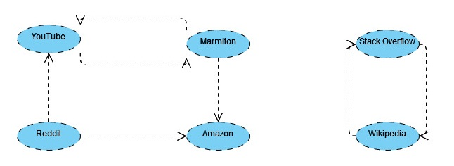
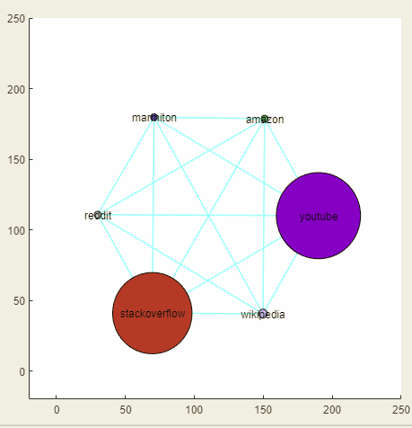
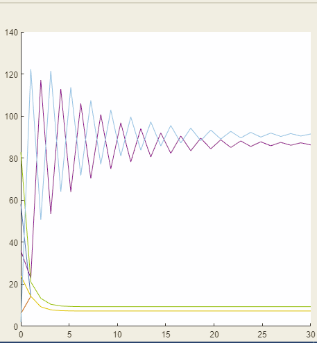

% Rapport du projet Search Engine Machine
% CABRERA Cyril - LOK Tshanon
% Polytech Paris-Saclay - ET5 INFO 2021-2022

$$\pagebreak$$

# Introduction
Google est une entreprise américaine créée en 1998 par Larry Page et Sergey Brin. Sa fondation repose sur le fameux "Google Search". Ce moteur de recherche est le site le plus visité au monde et le plus utilisé, gérant 3.5 milliards de requêtes par jour. Cela représente 92% de part de marché en 2021.

Cette domination se justifie par la fiabilité de ses réponses. Cela est dû en partie à son algorithme "PageRank". Cette algorithme trie les pages Internet en leur attribuant un rang en fonction de plusieurs critères particuliers. Plus les pages seront hautes de ce système de classification, plus elles seront recommandées aux utilisateurs qui cherchent des termes qui sont en liens avec celles-ci.

Dans ce projet de Data Science, nous avons décidé de recréer les caractéristiques principales de "Google Search", à savoir, l'algorithme "PageRank" de Google ainsi que la fonctionnalité de recherche par mot-clé.

# Méthodes et technologies utilisées
## Matrice Google et "PageRank"
### Matrice Google
L'algorithme "PageRank" a été développé par Google afin de classer un certains nombres de sites web en fonction de leur popularité.$\\$
La popularité d'une page web est définie par le nombre de références qui y sont faites sur tous les autres sites repertoriés.

Considérons par exemple un ensemble de sites web A, B, C et D qui pointent les uns vers les autres. Si A est référencé sur tous les autres sites, alors il aura une plus grande popularité que les autres. Lors d'une recherche, A sera classé plus haut que B, C et D dans les résultats.

Le web peut être assimilé à une chaîne de Markov où chaque point représente une page web et chaque transition représente le lien de référence entre ces pages. Donc si A pointe vers B, alors A fait référence à B sur sa page web. À ces transitions sont associées des probabilités qui sont la répartition équilibrée de la probabilité d'aller vers une page référencée.

**Mise en situation :**
Supposons que l'on ait 4 pages web qui pointent les unes vers les autres de la manière suivante.

{ width=60% }

Dans notre cas, on retrouve la matrice de transition suivante :

$$
\space \space
\begin{matrix}
A & B & C & D
\end{matrix}
$$
$$
L =
\begin{pmatrix}
0 & 1 & 0 & 0\\
0 & 0 & 0 & 0\\
0 & 0 & 0 & 1\\
0 & 0 & 1 & 0\\
\end{pmatrix}
\begin{matrix}
A \\ B \\ C \\ D
\end{matrix}
$$

Comme on peut le constater, la somme des éléments de la première colonne vaut 0 car l'élément A ne fait référence à aucun autre état.$\\$
Pour pallier ce problème, on suppose ainsi que tous les noeuds qui ne font référence à aucun état font maintenant référence à tous les états. On obtient ainsi la matrice S suivante :
$$
\space \space
\begin{matrix}
A & B & C & D
\end{matrix}
$$
$$
S =
\begin{pmatrix}
1/4 & 1 & 0 & 0 \\
1/4 & 0 & 0 & 0 \\
1/4 & 0 & 0 & 1 \\
1/4 & 0 & 1 & 0 \\
\end{pmatrix}
\begin{matrix}
A \\ B \\ C \\ D
\end{matrix}
$$

De plus, on remarque qu'il y a deux sous-graphes qui se dressent.
Le graphe [A,B] et [C,D].$\\$
On ne peut pas passer du graphe [A,B] à [C,D] et inversement. Google a donc mis en place une formule :

$$
M = \alpha S + (1 - \alpha) \times \frac{ones(N)}{N}
$$

avec $\alpha$ qui est un "damping factor" :
$$\alpha = 0.85$$
On obtient ainsi la matrice Google M suivante :
$$
\begin{matrix}
\qquad A \qquad & B \qquad & C \qquad & D
\end{matrix}
$$
$$
M =
\begin{pmatrix}
0.25 & 0.8875 & 0.0375 & 0.0375\\
0.25 & 0.0375 & 0.0375 & 0.0375\\
0.25 & 0.0375 & 0.0375 & 0.8875\\
0.25 & 0.0375 & 0.8875 & 0.0375\\
\end{pmatrix}
\begin{matrix}
A \\ B \\ C \\ D
\end{matrix}
$$
On se retrouve enfin avec une unique chaine de Markov régulière : pas d'état absorbant et pas de chaine secondaire.$\\$
Tous les états sont donc réguliers, c'est-à-dire qu'ils peuvent tous être quittés ou rejoints.

### Page Rank
Nous avons maintenant en place la matrice M correspondant à la matrice Google.$\\$
Il est possible, à partir de cette matrice de déterminer le rang de chaque page web.

**Qu'est ce qu'un rang ?**$\\$ Le rang correspond à la popularité d'un site web en fonction des autres.

**Explications :**

On considère notre matrice Google M et un vecteur P(t), correspondant à la répartition de la population dans les différents sites web.

À un temps t donné, si on souhaite connaitre la répartition de la population dans les différents sites web après un temps $\Delta t = 1$, il faudrait effectuer cette opération :
$$P(t + \Delta t) = M \cdot P(t)$$
On obtient donc au pas de temps suivant :
$$
P(t + 2 \Delta t) = M^2 \cdot P(t)\\$$

Comme la matrice M est indépendante du temps, c'est-à-dire homogène, on en déduit la formule suivante :
$$P(x) = M^x P(0)$$
avec $x$ le pas de temps et $P(0)$ la répartition initiale de population.

Donc, après $x$ pas de temps, on a une probabilité de $(M^{x})_{ij}$, pour passer de l'état j à i.

On remarque qu'à partir d'un certain temps $x$, la répartition de la population $P(x)$ ne varie plus beaucoup : c'est notre **état d'équilibre**.

Pour déterminer cet état d'équilibre, il faudrait faire tendre $x$ vers $+\infty$, et donc calculer :
$$\lim_{x \to +\infty} P(x) = M^x P(0)$$

Pour plus de simplicité, on notera $P(\infty)$ à la place de $\lim_{x \to +\infty} P(x)$.

Si on attend suffisament longtemps, l'état final i ne dépend plus de l'état initial j.
Donc $(M^{\infty})_{ij}$ ne dépend plus de j. On peut noter $(M^{\infty})_{ij}$ par $\pi_{i}$ avec $\vec \pi = (\pi_1,\pi_2,...)$. Donc $M^\infty = (\vec \pi, \vec \pi, ...)$.
$$
\begin{aligned}
P(\infty) &= M^\infty\cdot P(0) \\
          &= \vec \pi \cdot \vec {(\sum_{i}{P_i(0)})}\\
          &= \vec \pi \cdot 1 \\
          &= \vec \pi \\
\iff P(\infty) &= M \cdot P(\infty)\\
               &= \vec \pi
\end{aligned}
$$
Donc, on a : $M \cdot \vec \pi = \vec \pi$

Donc on sait que $\vec\pi$ est vecteur propre de M de valeur propre 1.

Ainsi, pour déterminer le rang des différentes pages web, il faut obligatoirement déterminer le vecteur propre associé à la valeur propre 1, c'est-à-dire trouver $v$ tel que :

$$
\begin{aligned}
M \cdot v &= \lambda v\\
      &= 1 v\\
\end{aligned}
$$

Les vecteurs propres et les valeurs propres peuvent être déterminés. On cherche donc les $\lambda_i$ tel que :
$$det(M - \lambda_i I) = 0$$ et un vecteur $v$ associé à $\lambda_i$ tel que :
$$ker(M - \lambda_i I)  \iff (M - \lambda_i I)\cdot v = 0$$

On calcule donc les vecteurs propres de M :

$$
\begin{matrix}
-0.3318 \qquad & 0.5443\qquad & 1\qquad & -0.85\qquad
\end{matrix}
$$

$$
\begin{pmatrix}
 0.8235 & -0.6870 & -0.1915 & 0.0000\\
 -0.5273 & -0.2682 & -0.1035 & -0.0000\\
 -0.1481 & 0.4776 & -0.6901 & -0.7071\\
 -0.1481 & 0.4776 & -0.6901 & 0.7071\\
\end{pmatrix}
$$

On prend la valeur propre la plus proche de 1 en valeur absolue. Dans notre exemple, il s'agit du vecteur propre associé à 1 à savoir :
$$
\begin{pmatrix}
-0.1915\\
-0.1035\\
-0.6901\\
-0.6901\\
\end{pmatrix}
$$

Après un certain temps, la distribution se stabilise et les valeurs sont similaires à celles du vecteur propre associé à la valeur 1.

## Choix de la modélisation
### Les pages web
Afin d'avoir un support pour notre modélisation, nous avons créé des pages web sous forme de fichiers txt.
Les pages web sont actuellement : stackoverflow, reddit, youtube, marmiton, amazon, wikipedia.
Tous ces fichiers txt sont regroupés dans le dossier "pages".

La mise en forme des pages web est la suivante :
Le titre doit être sous la forme :

[nom_de_la_page_web_sans_espace] + ".txt". $\\$
exemple : reddit.txt

Dans chaque fichier, on trouve un titre pour la page, du texte et des pointeurs vers d'autres fichiers qui sont sous la forme : $\\$ "pointeurvers :" + [nomPageWeb] + ".txt".

Dans notre modélisation, les pages web pointent entre elles de la manière suivante :

Par rapport à notre choix de modélisation, on peut voir que les sites les plus populaires sont :

1. stackoverflow
2. wikipedia (ex aequo avec 1)
3. marmiton
4. amazon
5. youtube
6. reddit

Il est possible d'ajouter d'autres site web en respectant la mise en forme de la modélisation des pages web.

### Fonctionnalités
Pour créer notre moteur de recherche, nous avons créé plusieurs fonctions dont les fonctionnalités seront présentées dans ce document.

### Function count_Nb_Pages
La fonction count_Nb_Pages prend en paramètre :

- path, une chaîne de caractères correspondant au chemin du dossier contenant nos pages web.

Cette fonction retourne le nombre de pages web dans le dossier, n.

### Function init_markov_chain
La fonction init_markov_chain prend en paramètre :

- n, le nombre de pages web
- path, le chemin des pages web
- alpha, le damping factor que l'on a fixé à 0.85.

Cette fonction permet d'initialiser et de retourner :

- M, une matrice correspondant à notre matrice Google,
- order, un vecteur contenant la liste des sites.

Le vecteur order permet de garder en mémoire l'ordre de lecture des différents sites web dans notre matrice M.

Explications :
La matrice M est une matrice de transition. On passe d'un état A à un état B via les références de chaque page. Pour être sûr de l'ordre des états dans la matrice M, on met en place un vecteur order qui permet de garder en mémoire l'ordre.

Dans notre modèle, le vecteur order a été fixé comme cela:
$$
order =
\begin{pmatrix}
    amazon\\
    marmiton\\
    reddit\\
    stackoverflow\\
    wikipedia\\
    youtube\\
\end{pmatrix}
$$

Le calcul de M a été réalisé de la même manière que celle décrite dans la partie "Matrice Google" de ce document. Voici les étapes de calculs :

On commence par créer une matrice de transition L.
$$
L =
\begin{pmatrix}
      0 & 0.5000 & 0.5000 &      0 &      0 &      0\\
      0 &      0 &      0 &      0 &      0 & 1.0000\\
      0 &      0 &      0 &      0 &      0 &      0\\
      0 &      0 &      0 &      0 & 1.0000 &      0\\
      0 &      0 &      0 & 1.0000 &      0 &      0\\
      0 & 0.5000 & 0.5000 &      0 &      0 &      0\\
\end{pmatrix}
$$
La somme des colonnes ne valent pas toutes 1. On fait donc pointer ces états à tous les autres états. On obtient la matrice S suivante :
$$
S =
\begin{pmatrix}
    0.1667 & 0.5000 & 0.5000 &      0 &      0 &      0\\
    0.1667 &      0 &      0 &      0 &      0 & 1.0000\\
    0.1667 &      0 &      0 &      0 &      0 &      0\\
    0.1667 &      0 &      0 &      0 & 1.0000 &      0\\
    0.1667 &      0 &      0 & 1.0000 &      0 &      0\\
    0.1667 & 0.5000 & 0.5000 &      0 &      0 &      0\\
\end{pmatrix}
$$

Enfin, pour éviter tout problème de sous-graphe, on applique la formule $M = \alpha S + (1 - \alpha) \times \frac{ones(N)}{N}$ ce qui nous donne M.
$$\pagebreak$$
$$
\begin{matrix}
    amazon \quad&
    marmiton \quad&
    reddit &
    stackoverflow&
    wikipedia&
    youtube\qquad \quad&
\end{matrix}
$$
$$
M =
\begin{pmatrix}
    0.1667 \qquad & 0.4500 \qquad & 0.4500\qquad  & 0.0250\qquad  & 0.0250 \qquad & 0.0250\\
    0.1667 \qquad & 0.0250 \qquad & 0.0250\qquad  & 0.0250\qquad  & 0.0250 \qquad & 0.8750\\
    0.1667 \qquad & 0.0250 \qquad & 0.0250\qquad  & 0.0250\qquad  & 0.0250 \qquad & 0.0250\\
    0.1667 \qquad & 0.0250 \qquad & 0.0250\qquad  & 0.0250\qquad  & 0.8750 \qquad & 0.0250\\
    0.1667 \qquad & 0.0250 \qquad & 0.0250\qquad  & 0.8750\qquad  & 0.0250 \qquad & 0.0250\\
    0.1667 \qquad & 0.4500 \qquad & 0.4500\qquad  & 0.0250\qquad  & 0.0250 \qquad & 0.0250\\
\end{pmatrix}
\begin{matrix}
    amazon\\
    marmiton\\
    reddit\\
    stackoverflow\\
    wikipedia\\
    youtube\\
\end{matrix}
$$

### Function find_rank
La fonction find_rank prend en paramètre :

- n, le nombre de pages web
- path, le chemin des pages
- M, la matrice Google.

Cette fonction permet d'initialiser et de retourner :

- StablePR, un vecteur contenant le score de chaque page web

Pour ce faire, il nous suffit de trouver le vecteur propre de la matrice Google M avec une valeur propre associée de 1.

En MatLab, la fonction eig permet de retourner les valeurs propres et vecteurs propres d'une matrice.
$$
X =
\begin{pmatrix}
    0.2659 & -0.3205 & -0.0000 & -0.0000 &  0.4676 & -0.0000\\
    0.3178 & -0.4136 &  0.7071 & -0.7071 & -0.7399 &  0.0000\\
    0.0918 & -0.0591 & -0.7071 &  0.7071 & -0.1057 &  0.0000\\
    0.6120 &  0.5568 &  0.0000 &  0.0000 & -0.0449 &  0.7071\\
    0.6120 &  0.5568 &  0.0000 &  0.0000 & -0.0449 & -0.7071\\
    0.2659 & -0.3205 &  0.0000 &  0.0000 &  0.4676 & -0.0000\\
\end{pmatrix}
$$
$$
\begin{pmatrix}
    1.0000 &      0 &      0 &       0 &       0 &       0\\
         0 & 0.7685 &      0 &       0 &       0 &       0\\
         0 &      0 & 0.0000 &       0 &       0 &       0\\
         0 &      0 &      0 & -0.0000 &       0 &       0\\
         0 &      0 &      0 &       0 & -0.6268 &       0\\
         0 &      0 &      0 &       0 &       0 & -0.8500\\
\end{pmatrix}
$$
Comme expliqué dans la partie "Page Rank" de ce document, on en déduit StablePR en prenant le vecteur propre dont la valeur propre vaut 1, c'est à dire la première colonne de X.

$$
StablePR =
\begin{pmatrix}
    0.2659\\
    0.3178\\
    0.0918\\
    0.6120\\
    0.6120\\
    0.2659\\
\end{pmatrix}
\begin{matrix}
    amazon\\
    marmiton\\
    reddit\\
    stackoverflow\\
    wikipedia\\
    youtube\\
\end{matrix}
$$

### Function sort_page_search
La fonction sort_page_search permet de chercher un mot parmi les différentes pages web et de retourner la liste des pages web contenant ce mot.

La fonction prend en paramètre :

- hdata : le mot que l'on cherhce
- StablePR : le page rank des pages web
- path : le chemin de chaque page web
- order : un vecteur de string contenant l'ordre de lecture des pages
- n : le nombre de pages web

La fonction renvoie :

- result, un vecteur contenant la liste des pages web contenant le mot cherché, triée de manière décroissante en fonction du page rank des pages web.

### L'interface graphique

### Création du vecteur P
Nous avons donc créé un vecteur P qui correspond à une distribution aléatoire de population qui se trouve déjà sur les differents sites web. Chaque nombre se réfère au vecteur order qui permet de connaitre le nombre dans chaque site précisément.

$$
P =
\begin{pmatrix}
    0.2330\\
    0.2585\\
    0.0369\\
    0.2614\\
    0.1818\\
    0.0284\\
\end{pmatrix}
\begin{matrix}
    amazon\\
    marmiton\\
    reddit\\
    stackoverflow\\
    wikipedia\\
    youtube\\
\end{matrix}
$$
Par exemple, on a 23,3% de la population qui se trouve initialement sur amazon.

*Note :* la somme des éléments du vecteur P vaut 1.

### Moteur de recherche en html
Afin de modéliser le moteur de recherche Google, une page html a été créée pour ressembler le plus possible à l'original. En effet, une barre de recherche permet d'obtenir la liste des sites qui contiennent le mot recherché.

Lorsqu'on lance notre moteur de recherche, une modélisation de l'évolution de la distribution de la population sur les différents sites web au cours du temps est faite. On peut ainsi voir sur quels sites vont les personnes.

Pour notre modélisation, et pour la suite, le nombre total de personnes ne change pas et est fixé par le paramètre pop_tot.

Les deux représentations graphiques sont corrélées et les couleurs sont cohérentes entre les deux fenêtres.

{ width=50% } \ { width=50% }

Dans la première fenêtre, on observe un graphe représentant les liens entre les différentes pages. La taille des cercles correspond à la quantité de personnes qui visitent le site en question.

Dans la seconde fenêtre, on voit l'évolution de la population sur les sites en fonction du temps.

On calcule la répartition de population de la manière suivante :
$$
P(t + \Delta t) = M \cdot P(t)
$$

### Obtention du mot cherché et retour des pages pertinentes
Une fois qu'un mot X a été ajouté dans la barre de recherche et que le bouton "search" a été cliqué, la fonction request va être appelée.

Le mot X va être recherché parmi toutes les pages web à l'aide de la fonction sort_page_search.
Cette fonction va lister les pages qui contiennent X. Cette liste va ensuite être triée en fonction du page rank (donc en fonction de StablePR) de manière décroissante.

Une fois la liste établie, les résultats sont envoyés vers la page html pour que ces résultats soient affichés.

De plus, la modélisation de l'évolution de la répartition de la population en fonction du temps va être relancée avec une distribution P initiale fixée en fonction de la liste des sites contenants le mot X cherché.

Par exemple, si les sites contenant le mot X sont : [amazon, reddit, youtube], alors le vecteur P est donné par :
$$
P(0) =
\begin{pmatrix}
    0.3333\\
         0\\
    0.3333\\
         0\\
         0\\
    0.3333\\
\end{pmatrix}
\begin{matrix}
    amazon\\
    marmiton\\
    reddit\\
    stackoverflow\\
    wikipedia\\
    youtube\\
\end{matrix}
$$

Par la suite, la fonction display_user_distribution va calculer l'évolution de la répartition de la population à l'aide de la formule suivante :
$$ P(t+ \Delta t) = M * P(t) $$

Pour obtenir la quantité de personnes dans chaque site, on fait :
$$ pop\_tot * P(t + \Delta t)$$

On remarque que peu importe le $P(0)$, la distribution de la population sur les sites web revient à son état de stabilité.

# Temps pour diviser par x la distance à l'équilibre
Peu importe le $P(0)$, la distribution de la population sur les sites web revient à son état de stabilité.

**Combien de temps met-on pour diviser par 2 la distance à l'état de stabilité ?**

On peut le calculer de la manière suivante :
$T_{1/2} = - \frac{\Delta t \times ln(2)}{ln(| \lambda_2 |)}$ avec $\lambda_2$ la deuxième plus grande valeur propre de $D$ après $\lambda_1 = 1$.

$D = D_{\vec r} [Z^{diag} \vec 1 - Z \cdot I]$ avec $Z = (M^{\infty} - M + I)^{-1}$, $r$ tel que $r_i = \Delta t / \pi_i$
On prend la deuxième plus grande (en valeur absolue) valeur propre.

Dans notre modèle,
$T_{1/2} = 4.6778$ minutes et $T_{1/10} = 15.5392$ minutes en supposant que $\Delta t = 20$ minutes.

# Répartition du travail

Ce projet a été réalisé en grande partie sur les heures dédiées au projet dans l'emploi du temps. Nous avons donc travaillé ensemble sur la majorité du projet.

La mise en place de la modélisation, la création de la matrice Google M, les différents vecteurs ont été faits lors des 3 séances de TP de Data Science.

Par la suite, l'interface graphique ainsi que le système de requêtes pour effectuer des recherches ont été ajoutés après ces trois séances.

En outre, le projet a été réparti de manière équitable.

# Résultats
Le programme est donc bien fonctionnel. Il est possible de faire des recherches sur l'ensemble des sites que nous avons créés.

Au début du programme, on arrive donc sur la page d'accueil du moteur de recherche. On peut voir l'évolution du classement des pages arriver à l'équilibre.

{ width=70% }

On est ensuite invité à entrer un mot-clé pour faire une recherche.

{ width=70% }

Lorsque l'on lance la recherche, on peut voir l'état initial du vecteur de population au temps t = 0.

Sur la page principale, on observe les résultats fournis par le moteur de recherche.

{ width=70% }

Après un certain temps, on peut voir que pour toutes requêtes effectuées, le vecteur population arrive au même état d'équilibre correspondant au classement des pages stable déduit avec la matrice Google.

{ width=70% }

Une vidéo de démonstration a été réalisée et est disponible dans le code source du projet.

$$\pagebreak$$

# Conclusion
Nous avons donc créé un moteur de recherche inspiré par Google Search et son système de classification des sites web "Page Rank".

La modélisation que nous avons réalisée a pu nous donner des résultats cohérents lorsque nous effectuions des requêtes dans la barre de recherche. On pouvait suivre en direct l'évolution des mouvements de population entre les différents sites au cours du temps.

Il y a certains points que nous aurions aimé améliorer sur ce projet pour aller plus loin :

- Créer plus de pages webs.
- Avoir une plus grande flexibilité sur les mots-clés. En cherchant "marmite", on ne trouvera pas les pages contenant le mot "marmites" par exemple.
- Ajouter une influence sur l'ordre d'apparition des résultats dans la page de recherche de sortes à ce que les sites citant le plus le terme recherché apparaissent plus haut.
- Améliorer l'affichage des résultats pour se rapprocher d'un vrai moteur de recherche en montrant notamment le contenu de la page.

Nous pensons que ce projet aurait pu être utile pour une entreprise. Par exemple pour créer un système interne permettant de faire des liens entre des documents contenus dans des archives et de faire des recherches pour retrouver ceux qui nous intéressent en établissant une hiérarchie d'utilité dans les résultats.

$$\pagebreak$$

# Bibliographie
*"PageRank algorithm, fully explained"*, **towards data science**, Amrani Amine, 20 décembre 2020. Disponible sur : https://towardsdatascience.com/pagerank-algorithm-fully-explained-dc794184b4af

*Cours de Data Science*, **Pierre Desesquelles**, délivré septembre 2021.

*"Create HTML file that can trigger or respond to Data changes"*, MatLab Documentation. Disponible ici : https://fr.mathworks.com/help/matlab/creating_guis/create-an-html-file-that-sets-data-or-responds-to-data-changes-from-matlab.html

*"Create HTML file that can trigger or respond to Data changes"*, MatLab Documentation. Disponible ici : https://fr.mathworks.com/help/matlab/creating_guis/create-an-html-file-that-sets-data-or-responds-to-data-changes-from-matlab.html

*"uihtml"* MatLab Documentation. Disponible ici : https://fr.mathworks.com/help/matlab/ref/uihtml.html

*"How to create a filled circle?"* MatLab Answers. Disponible ici: https://fr.mathworks.com/matlabcentral/answers/437523-how-to-create-a-filled-circle
