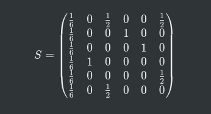

% Rapport du projet Search Engine Machine
% CABRERA Cyril - LOK Tshanon
% Polytech Paris-Saclay - ET5 Info
% 2021-2022

# Table des matières
... A faire ...

# Introduction
Google est une entreprise américaine créée en 1998 par Larry Page et Sergey Brin. Sa fondation repose sur le fameux "Google Search". Ce moteur de recherche est le site le plus visité au monde et le plus utilisé, gérant 3.5 milliards de requêtes par jour. Cela représente 92% de part de marché en 2021.

Cette domination se justifie par la fiabilité de ses réponses. Cela est dû en partie à son algorithme "PageRank". Cette algorithme trie les pages Internet en leur attribuant un rang en fonction de plusieurs critères particuliers. Plus les pages seront hautes de ce système de classification, plus elles seront recommandées aux utilisateurs qui cherchent des termes qui sont en liens avec celles-ci.

Dans ce projet de Data Science, nous avons décidé de recréer les caractéristiques principales de "Google Search", à savoir, l'algorithme "PageRank" de Google ainsi que la fonctionnalité de recherche par mot-clé.

# Méthodes et technologies utilisées
## Matrice Google et "PageRank"
L'algorithme "PageRank" a été développé par Google afin de classer un certains nombres de sites web en fonction de leur popularité. 
La popularité d'une page web est définie par le nombre de références qui y sont faites sur tous les autres sites repertoriés.

Considérons par exemple un ensemble de sites web A, B, C, D, E et F. Si A est référencé sur tous les autres sites, alors il aura une plus grande popularité que les autres. Lors d'une recherche, A sera classé plus haut que B, C, D, E et F dans les résultats.

Le web peut être assimilé à une chaîne de Markov où chaque point représente une page web et chaque transition représente le lien de référence entre ces pages. Donc si A pointe vers B, alors A fait référence à B sur sa page web. À ces transitions sont associées des probabilités qui sont la répartition équilibrée de la probabilité d'aller vers une page référencée.

Supposons que l'on ait 6 pages web qui pointent les unes vers les autres de la manière suivante.
[insérer une image pour modéliser]

Dans notre cas, on retrouve la matrice de transition suivante :

Cependant, la somme des éléments de la première colonne vaut 0 car l'élément A ne fait référence à aucun autre état. 
Le problème est que l'algorithme ne pourra pas converger. 
Pour pallier ce problème, une notion de téléportation est introduite. On suppose ainsi que tous les noeuds qui ne font référence à aucun état font maintenant référence à tous les états. On obtient ainsi la matrice S suivante :

Enfin, on remarque qu'il y a deux sous-graphes qui se dressent.
Le graphe [A,C,E] et [B,D].
On ne peut pas passer du graphe [A,C,E] à [B,D] et inversement. Google a donc mis en place une formule : 
M = alpha * S + (1 - alpha)/N * S 
avec alpha qui est un damping factor = 0.85
On a ainsi la matrice google M suivante : 

## Choix de la modélisation
Pour le projet, nous avons mis en place une matrice Google ainsi qu'une interface graphique. 
Mise en place du page rank stable
Prise en compte de la popularité, de la proba de passer d'une page à une autre
### Les pages web
Afin d'avoir un support pour notre modélisation, nous avons créé des pages web sous forme de fichiers txt.
Les pages web sont actuellement : stackoverflow, reddit, youtube, marmiton, amazon, wikipedia.
Tous ces fichiers txt sont regroupés dans le dossier "pages".

La mise en forme des pages web est la suivante : 
Le titre doit être sous la forme : [nom_de_la_page_web_sans_espace] + ".txt".
Dans chaque fichier, on trouve un titre pour la page, du texte et des pointeurs vers d'autres fichiers qui sont sous la forme : "pointeurvers : [nomPageWeb].txt". 

Dans notre modélisation, les pages web pointent entre elles de la manière suivante :
[Photo]

Il possible d'ajouter d'autres site web en respectant la mise en forme de la modélisation des pages web.

### Code
#### Function count_Nb_Pages
On compte le nombre de pages web (n) dans un dossier via un chemin (nommé path dans notre code)

#### Function init_markov_chain
Création de la matrice Google et création d'un vecteur order contenant dans l'ordre la liste des pages web dans un chemin spécifié

matrice M = matrice google

#### Création du vecteur P
Le vecteur P correspond à une distribution aléatoire de population qui se trouve deja sur les differents sites web.

#### Function find_rank
Permet de déterminer le vecteur propre de la matrice Google M.
Expliciter le lien avec la partie expliquant la matrice Google.

#### Function sort_page_search

#### L'interface graphique
Ce qu'on a fait
\+ Dire que les couleurs sont cohérentes entre elles

#### Obtention du mot cherché et retour des pages pertinentes
- Retour depuis la page html
- Calcul fait
- Envoie des données vers la page html

- Vecteur P changé
- Modélisation dans l'interface graphique modifié pour correspondre à la situation nouvelle.

# Répartition du travail
On s'est bien réparti le travail **chacal**.

# Résultats
Photo.
Commentaires sur les photos. On visualise bien la stabilité de la population dans notre modélisation : tout semble cohérent.

Sensible à la casse

# Conclusion
Ce que l'on aurait pu ajouter, améliorer.
Résumé de la partie résultat.
On aurait pu, pour aller plus loin, essayer de faire une application : dans le sens où on aurait pu créer un exécuteur pour ne pas aller sur matlab puis cliquer sur RUN.
On pense que ce projet aurait pu être utile pour une entreprise notament dans le cas où cette dernière souhaiterait développer un moteur de recherche interne à l'entreprise tout en essayant de faire des liens entre plusieurs sites, documents. Et ainsi voir les documents/sites les plus utiles.

# Bibliographie
source : https://www.google.com/search/howsearchworks/algorithms/

source : "PageRank algorithm, fully explained", toward data science, Amrani Amine, 20 décembre 2020. Disponible sur : https://towardsdatascience.com/pagerank-algorithm-fully-explained-dc794184b4af

source : Cours de Data Science par Monsieur Desesquelles, délivré septembre 2021.
